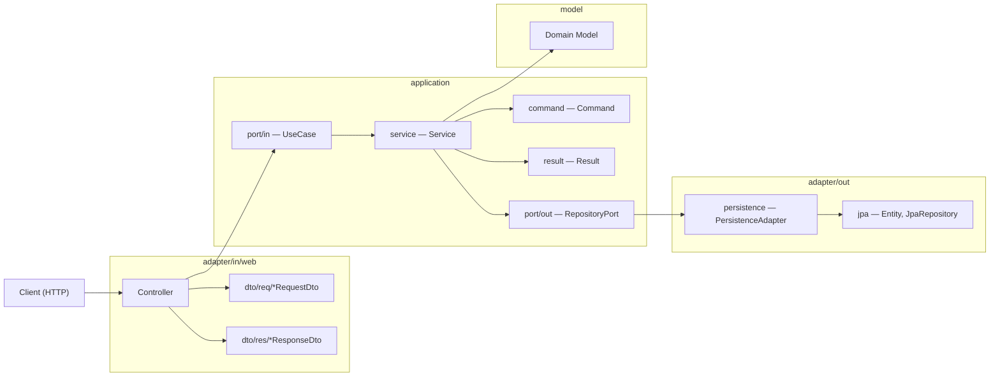
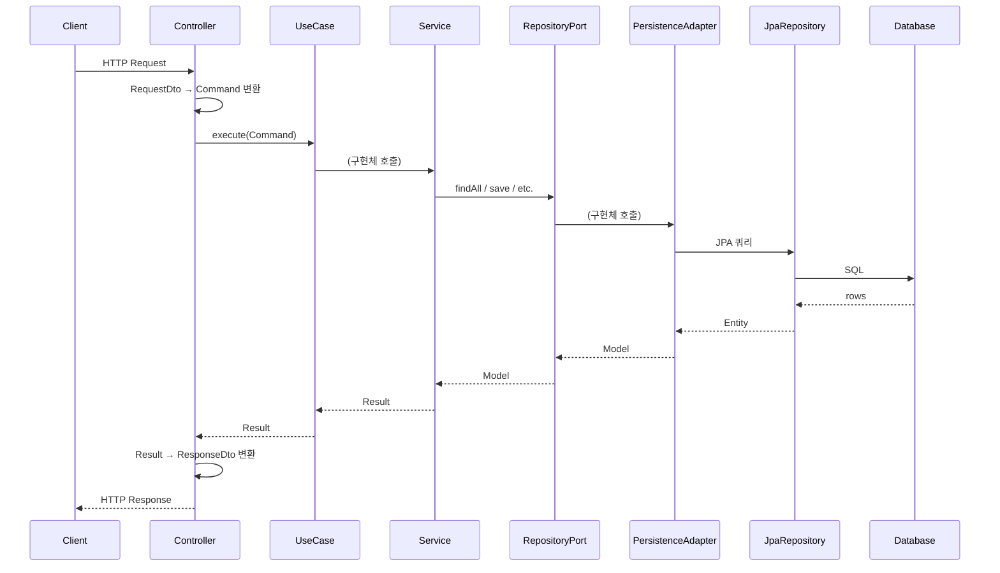

# Backend Hexagonal Architecture — Directory & Naming Convention

> **레퍼런스 모듈**: `menu/` (user-facing) · `admin/menu/` (admin)
> 새 feature module을 추가하거나 기존 모듈을 수정할 때 반드시 이 규칙을 따른다.

---

# Part A. 디렉토리 아키텍처

---

## A-1. 아키텍처 레이어 흐름



---

## A-2. 표준 디렉토리 트리 (menu 모듈 기준)

### A-2-A. User-facing 모듈 (`menu/`)

```
menu/
├── adapter/
│   ├── in/
│   │   └── web/
│   │       ├── MenuController.java                  ← REST Controller
│   │       └── dto/                                  ← DTO (req/res 분리 없음 — 조회 전용)
│   │           ├── MenuListRequestDto.java
│   │           ├── MenuListResponseDto.java
│   │           ├── MenuResponseDto.java
│   │           ├── MenuDetailResponseDto.java
│   │           ├── MenuImageListResponseDto.java
│   │           └── MenuImageResponseDto.java
│   └── out/
│       ├── jpa/                                      ← JPA Entity & Repository
│       │   ├── MenuEntity.java
│       │   ├── MenuJpaRepository.java
│       │   ├── MenuImageEntity.java
│       │   └── MenuImageJpaRepository.java
│       └── persistence/                              ← Port 구현 어댑터
│           ├── MenuPersistenceAdapter.java
│           └── MenuImagePersistenceAdapter.java
├── application/
│   ├── command/                                      ← 입력 VO
│   │   ├── MenuListCommand.java
│   │   ├── GetMenuCommand.java
│   │   └── GetMenuImageListCommand.java
│   ├── port/
│   │   ├── in/                                       ← UseCase 인터페이스
│   │   │   ├── UserMenuUseCase.java
│   │   │   └── ViewUserMenuListUseCase.java
│   │   └── out/                                      ← Repository 포트
│   │       ├── MenuRepositoryPort.java
│   │       └── MenuImageRepositoryPort.java
│   ├── result/                                       ← 출력 VO
│   │   ├── MenuListResult.java
│   │   ├── GetMenuResult.java
│   │   └── GetMenuImageListResult.java
│   └── service/                                      ← UseCase 구현
│       └── MenuService.java
└── model/                                            ← 도메인 모델
    ├── Menu.java
    └── MenuImage.java
```

### A-2-B. Admin 모듈 (`admin/menu/`)

```
admin/menu/
├── adapter/
│   ├── in/
│   │   └── web/
│   │       ├── AdminMenuController.java              ← Admin REST Controller
│   │       └── dto/
│   │           ├── req/                              ← Request DTO (CRUD 있으므로 req/res 분리)
│   │           │   ├── CreateMenuRequestDto.java
│   │           │   ├── UpdateMenuRequestDto.java
│   │           │   ├── MenuListRequestDto.java
│   │           │   ├── ReorderMenusRequestDto.java
│   │           │   └── ReorderMenuImagesRequestDto.java
│   │           └── res/                              ← Response DTO
│   │               ├── CreateMenuResponseDto.java
│   │               ├── UpdateMenuResponseDto.java
│   │               ├── MenuListResponseDto.java
│   │               ├── MenuResponseDto.java
│   │               ├── MenuDetailResponseDto.java
│   │               ├── MenuImageListResponseDto.java
│   │               └── MenuImageResponseDto.java
│   └── out/
│       └── persistence/                              ← Port 구현 어댑터
│           ├── AdminMenuPersistenceAdapter.java
│           └── AdminMenuImagePersistenceAdapter.java
├── application/
│   ├── command/                                      ← 입력 VO
│   │   ├── CreateMenuCommand.java
│   │   ├── UpdateMenuCommand.java
│   │   ├── DeleteMenuCommand.java
│   │   ├── MenuListCommand.java
│   │   ├── GetMenuCommand.java
│   │   ├── GetMenuImageListCommand.java
│   │   ├── ReorderMenusCommand.java
│   │   └── ReorderMenuImagesCommand.java
│   ├── port/
│   │   ├── in/                                       ← UseCase 인터페이스
│   │   │   ├── AdminMenuUseCase.java                 ← 통합 인터페이스
│   │   │   ├── CreateAdminMenuUseCase.java
│   │   │   ├── UpdateAdminMenuUseCase.java
│   │   │   ├── DeleteAdminMenuUseCase.java
│   │   │   ├── ViewAdminMenuListUseCase.java
│   │   │   ├── ReorderAdminMenuUseCase.java
│   │   │   ├── ReorderMenuImagesUseCase.java
│   │   │   └── AddMenuImageUseCase.java
│   │   └── out/                                      ← Repository 포트
│   │       ├── AdminMenuRepositoryPort.java
│   │       └── AdminMenuImageRepositoryPort.java
│   ├── result/                                       ← 출력 VO
│   │   ├── CreateMenuResult.java
│   │   ├── UpdateMenuResult.java
│   │   ├── MenuListResult.java
│   │   ├── GetMenuResult.java
│   │   └── GetMenuImageListResult.java
│   └── service/                                      ← UseCase 구현
│       └── AdminMenuService.java
└── model/                                            ← 도메인 모델
    ├── AdminMenu.java
    └── AdminMenuImage.java
```

---

## A-3. 전체 Feature Module 현황

아래 테이블은 각 모듈의 현재 구조가 표준(menu)과 **얼마나 일치/이탈하는지**를 보여줍니다.

### A-3-A. User-facing 모듈

| 모듈 | adapter/in | adapter/out/jpa | adapter/out/persistence | command | port/in | port/out | result | service | model | 비고 |
|------|:---:|:---:|:---:|:---:|:---:|:---:|:---:|:---:|:---:|------|
| **menu** ✅ | ✅ | ✅ | ✅ | ✅ | ✅ | ✅ | ✅ | ✅ | ✅ | 레퍼런스 |
| cart | ✅ | ✅ | ✅ | ✅ | ✅ | ✅ | ✅ | ✅ | ✅ | `domain/model/` 빈 폴더 존재 |
| category | ✅ | ✅ | ✅ | ✅ | ✅ | ✅ | ✅ | ✅ | ✅ | `domain/model/` 빈 폴더 존재 |
| order | ✅ | ✅ | ✅ | ✅ | ✅ | ✅ | ✅ | ✅ | ✅ | `domain/model/` 빈 폴더 존재, Service 분리(3개) |
| coupon | ❌ | ✅ | ❌ | ❌ | ❌ | ❌ | ❌ | ❌ | ❌ | JPA만 존재 (미완성) |
| favorite | ✅ | ✅ | ✅ | ✅ | ✅ | ✅ | ✅ | ✅ | ✅ | 완전 일치 |
| inquiry | ✅ | ✅ | ✅ | ❌ | ✅ | ✅ | ❌ | ✅ | ✅ | command/result 없음 |
| notice | ✅ | ✅ | ✅ | ❌ | ✅ | ✅ | ❌ | ✅ | ✅ | command/result 없음 |
| notification | ✅ | ✅ | ✅ | ❌ | ✅ | ✅ | ❌ | ✅ | ✅ | command/result 없음 |
| payment | ❌ | ✅ | ✅ | ❌ | ✅ | ✅ | ❌ | ✅ | ✅ | Controller 없음, 외부연동(tosspayments) |
| user | ✅ | ❌ | ❌ | ❌ | ❌ | ❌ | ❌ | ❌ | ❌ | Controller만 존재 |
| visitor | ✅ | ✅ | ✅ | ❌ | ✅ | ✅ | ❌ | ✅ | ✅ | command/result 없음 |

### A-3-B. Admin 모듈

| 모듈 | adapter/in | dto req/res | adapter/out | command | port/in | port/out | result | service | model | 비고 |
|------|:---:|:---:|:---:|:---:|:---:|:---:|:---:|:---:|:---:|------|
| **admin/menu** ✅ | ✅ | ✅ req/res | ✅ | ✅ | ✅ | ✅ | ✅ | ✅ | ✅ | 레퍼런스 |
| admin/notice | ✅ | ✅ req/res | ✅ | ✅ | ✅ | ✅ | ✅ | ✅ | ❌ | model 없음 |
| admin/category | ✅ | ❌ | ❌ | ❌ | ❌ | ❌ | ❌ | ❌ | ❌ | Controller만 |
| admin/inquiry | ✅ | ❌ | ❌ | ❌ | ❌ | ❌ | ❌ | ❌ | ❌ | Controller만 |
| admin/member | ✅ | DTO(분리X) | ✅ mail | ❌ | ✅ | ✅ | ❌ | ✅ | ❌ | command/result/model 없음 |
| admin/order | ✅ | ❌ | ❌ | ❌ | ✅ | ❌ | ❌ | ✅ | ❌ | 최소 구조 |
| admin/settings | ✅ | ❌ | ✅ | ❌ | ✅ | ✅ | ❌ | ✅ | ✅ | command/result 없음 |

> ⚠️ `domain/model/` 빈 폴더가 cart, category, order에 잔존합니다. 정리 대상입니다.

---

## A-4. 레이어별 책임 요약

| 레이어 | 패키지 | 책임 | 예시 |
|--------|--------|------|------|
| **Adapter In** | `adapter/in/web/` | HTTP 요청 수신, DTO ↔ Command/Result 변환 | `MenuController`, `*RequestDto`, `*ResponseDto` |
| **Adapter Out (JPA)** | `adapter/out/jpa/` | JPA Entity 정의, Spring Data Repository | `MenuEntity`, `MenuJpaRepository` |
| **Adapter Out (Persistence)** | `adapter/out/persistence/` | Repository Port 구현, Entity ↔ Model 변환 | `MenuPersistenceAdapter` |
| **Application (Port In)** | `application/port/in/` | UseCase 인터페이스 정의 | `UserMenuUseCase`, `CreateAdminMenuUseCase` |
| **Application (Port Out)** | `application/port/out/` | Repository 인터페이스 (외부 의존 추상화) | `MenuRepositoryPort` |
| **Application (Command)** | `application/command/` | Service 입력 VO (불변 객체) | `MenuListCommand`, `CreateMenuCommand` |
| **Application (Result)** | `application/result/` | Service 출력 VO (불변 객체) | `MenuListResult`, `GetMenuResult` |
| **Application (Service)** | `application/service/` | UseCase 구현, 비즈니스 로직 | `MenuService`, `AdminMenuService` |
| **Model** | `model/` | 도메인 모델 (순수 Java 객체) | `Menu`, `MenuImage` |

---

## A-5. 데이터 흐름 다이어그램



---

# Part B. 네이밍 규칙

---

## B-1. 패키지(폴더) 구조

모든 feature module은 위 Part A의 표준 트리를 **그대로** 사용한다.
`{Feature}` 자리에 도메인 이름을 넣는다 (단수형 소문자, 예: `menu`, `cart`, `order`).

```
{feature}/
├── adapter/
│   ├── in/
│   │   └── web/
│   │       ├── {Feature}Controller.java
│   │       └── dto/
│   │           ├── req/           ← (CRUD 모듈만) Request DTO
│   │           └── res/           ← (CRUD 모듈만) Response DTO
│   └── out/
│       ├── jpa/                   ← Entity, JpaRepository
│       └── persistence/           ← PersistenceAdapter (Port 구현)
├── application/
│   ├── command/                   ← Service 입력 VO
│   ├── port/
│   │   ├── in/                    ← UseCase 인터페이스
│   │   └── out/                   ← RepositoryPort 인터페이스
│   ├── result/                    ← Service 출력 VO
│   └── service/                   ← UseCase 구현
└── model/                         ← 도메인 모델 (순수 Java)
```

### 폴더 이름 규칙

| 항목 | 규칙 | 예시 |
|------|------|------|
| Feature 최상위 | **소문자 단수형** | `menu`, `cart`, `order`, `notice` |
| Admin 모듈 | `admin/{feature}/` | `admin/menu/`, `admin/notice/` |
| 하위 패키지 | 고정 이름 사용 | `adapter`, `in`, `out`, `web`, `dto`, `req`, `res`, `jpa`, `persistence`, `application`, `command`, `port`, `result`, `service`, `model` |
| 도메인 모델 폴더 | **`model/`** 으로 통일 | ~~`domain/model/`~~ 사용 금지 |

> ⚠️ `domain/model/` 은 레거시 구조. 반드시 `model/` 로 통일.

---

## B-2. 파일(클래스) 네이밍

### B-2-A. Controller

| 위치 | 패턴 | 예시 |
|------|------|------|
| User-facing | `{Feature}Controller.java` | `MenuController.java` |
| Admin | `Admin{Feature}Controller.java` | `AdminMenuController.java` |
| File upload 전용 | `{Feature}FileController.java` / `Admin{Feature}UploadController.java` | `NoticeFileController.java` |

### B-2-B. DTO

| 용도 | 패턴 | 예시 |
|------|------|------|
| 목록 요청 | `{Feature}ListRequestDto.java` | `MenuListRequestDto.java` |
| 생성 요청 | `Create{Feature}RequestDto.java` | `CreateMenuRequestDto.java` |
| 수정 요청 | `Update{Feature}RequestDto.java` | `UpdateMenuRequestDto.java` |
| 정렬 요청 | `Reorder{Feature}sRequestDto.java` | `ReorderMenusRequestDto.java` |
| 목록 응답 | `{Feature}ListResponseDto.java` | `MenuListResponseDto.java` |
| 단건 응답 | `{Feature}ResponseDto.java` | `MenuResponseDto.java` |
| 상세 응답 | `{Feature}DetailResponseDto.java` | `MenuDetailResponseDto.java` |
| 생성 응답 | `Create{Feature}ResponseDto.java` | `CreateMenuResponseDto.java` |
| 수정 응답 | `Update{Feature}ResponseDto.java` | `UpdateMenuResponseDto.java` |

> **DTO 위치 규칙:**
> - 조회 전용 모듈 (User): `dto/` 폴더에 플랫하게 배치
> - CRUD 모듈 (Admin): `dto/req/` · `dto/res/` 로 분리

### B-2-C. JPA (adapter/out/jpa)

| 용도 | 패턴 | 예시 |
|------|------|------|
| Entity | `{Feature}Entity.java` | `MenuEntity.java`, `MenuImageEntity.java` |
| JPA Repository | `{Feature}JpaRepository.java` | `MenuJpaRepository.java` |

### B-2-D. Persistence Adapter (adapter/out/persistence)

| 위치 | 패턴 | 예시 |
|------|------|------|
| User-facing | `{Feature}PersistenceAdapter.java` | `MenuPersistenceAdapter.java` |
| Admin | `Admin{Feature}PersistenceAdapter.java` | `AdminMenuPersistenceAdapter.java` |

### B-2-E. Command (application/command)

| 용도 | 패턴 | 예시 |
|------|------|------|
| 목록 조회 | `{Feature}ListCommand.java` | `MenuListCommand.java` |
| 단건 조회 | `Get{Feature}Command.java` | `GetMenuCommand.java` |
| 하위자원 목록 | `Get{Feature}{Sub}ListCommand.java` | `GetMenuImageListCommand.java` |
| 생성 | `Create{Feature}Command.java` | `CreateMenuCommand.java` |
| 수정 | `Update{Feature}Command.java` | `UpdateMenuCommand.java` |
| 삭제 | `Delete{Feature}Command.java` | `DeleteMenuCommand.java` |
| 정렬 | `Reorder{Feature}sCommand.java` | `ReorderMenusCommand.java` |

### B-2-F. UseCase (application/port/in)

| 위치 | 패턴 | 예시 |
|------|------|------|
| User 통합 인터페이스 | `User{Feature}UseCase.java` | `UserMenuUseCase.java` |
| User 세부 | `View{Role}{Feature}ListUseCase.java` | `ViewUserMenuListUseCase.java` |
| Admin 통합 인터페이스 | `Admin{Feature}UseCase.java` | `AdminMenuUseCase.java` |
| Admin 세부 CRUD | `{Action}Admin{Feature}UseCase.java` | `CreateAdminMenuUseCase.java`, `DeleteAdminMenuUseCase.java` |
| Admin 기타 | `{Action}{Feature}{Sub}UseCase.java` | `ReorderMenuImagesUseCase.java`, `AddMenuImageUseCase.java` |

### B-2-G. Repository Port (application/port/out)

| 위치 | 패턴 | 예시 |
|------|------|------|
| User-facing | `{Feature}RepositoryPort.java` | `MenuRepositoryPort.java` |
| Admin | `Admin{Feature}RepositoryPort.java` | `AdminMenuRepositoryPort.java` |
| 하위자원 | `{Feature}{Sub}RepositoryPort.java` | `MenuImageRepositoryPort.java` |

### B-2-H. Result (application/result)

| 용도 | 패턴 | 예시 |
|------|------|------|
| 목록 조회 | `{Feature}ListResult.java` | `MenuListResult.java` |
| 단건 조회 | `Get{Feature}Result.java` | `GetMenuResult.java` |
| 하위자원 목록 | `Get{Feature}{Sub}ListResult.java` | `GetMenuImageListResult.java` |
| 생성 | `Create{Feature}Result.java` | `CreateMenuResult.java` |
| 수정 | `Update{Feature}Result.java` | `UpdateMenuResult.java` |

### B-2-I. Service (application/service)

| 위치 | 패턴 | 예시 |
|------|------|------|
| User-facing | `{Feature}Service.java` | `MenuService.java` |
| Admin | `Admin{Feature}Service.java` | `AdminMenuService.java` |

> 하나의 모듈에 Service가 다수 필요한 경우, **책임 기준 접미사**를 붙인다:
> `{Feature}QueryService.java`, `Cancel{Feature}Service.java`

### B-2-J. Domain Model (model)

| 용도 | 패턴 | 예시 |
|------|------|------|
| 메인 모델 | `{Feature}.java` | `Menu.java`, `Order.java` |
| 하위 모델 | `{Feature}{Sub}.java` | `MenuImage.java`, `OrderItem.java` |
| Admin 모델 | `Admin{Feature}.java` | `AdminMenu.java` |

---

## B-3. 일반 네이밍 규칙

### B-3-A. Java 표준
- **패키지명**: 소문자 단수형 (`menu`, `cart`, `order`)
- **클래스명**: PascalCase (`MenuController`, `CreateMenuCommand`)
- **인터페이스**: PascalCase, 접미사로 역할 표현 (`UseCase`, `Port`)

### B-3-B. 접두사·접미사 일관성
| 요소 | 접미사 | 금지 |
|------|--------|------|
| Controller | `Controller` | `~Api`, `~Rest` |
| DTO | `RequestDto` / `ResponseDto` | `~Request`, `~Response`, `~VO` |
| Entity | `Entity` | `~Model` (model 패키지와 혼동) |
| Repository (JPA) | `JpaRepository` | `~Dao`, `~DataRepository` |
| Repository (Port) | `RepositoryPort` | `~Repository` (JPA와 혼동) |
| Persistence Adapter | `PersistenceAdapter` | `~Adapter` (역할 불명확) |
| UseCase | `UseCase` | `~Port` |
| Command | `Command` | `~Input`, `~Param` |
| Result | `Result` | `~Output`, `~Response` |
| Service | `Service` | `~Impl`, `~ServiceImpl` |

### B-3-C. Admin vs User 접두사
- Admin 모듈 내 클래스에는 `Admin` 접두사 사용:
  `AdminMenuController`, `AdminMenuService`, `AdminMenuRepositoryPort`
- User-facing 모듈 클래스에는 접두사 없음 (기본):
  `MenuController`, `MenuService`, `MenuRepositoryPort`
- UseCase에서 Role 구분이 필요할 때만 `User` 접두사:
  `UserMenuUseCase`, `ViewUserMenuListUseCase`

---

## B-4. 새 모듈 추가 체크리스트

새 도메인 `{feature}`를 추가할 때:

- [ ] `{feature}/model/` — 도메인 모델 먼저 정의 (`{Feature}.java`)
- [ ] `{feature}/adapter/out/jpa/` — `{Feature}Entity.java`, `{Feature}JpaRepository.java`
- [ ] `{feature}/application/port/out/` — `{Feature}RepositoryPort.java`
- [ ] `{feature}/adapter/out/persistence/` — `{Feature}PersistenceAdapter.java`
- [ ] `{feature}/application/command/` — 필요한 Command VO들
- [ ] `{feature}/application/result/` — 필요한 Result VO들
- [ ] `{feature}/application/port/in/` — UseCase 인터페이스
- [ ] `{feature}/application/service/` — `{Feature}Service.java` (UseCase 구현)
- [ ] `{feature}/adapter/in/web/` — `{Feature}Controller.java`
- [ ] `{feature}/adapter/in/web/dto/` — Request/Response DTO들
- [ ] Admin이 필요하면 `admin/{feature}/` 동일 구조로 별도 생성

---

## B-5. ❌ 금지 사항

1. **`domain/model/` 폴더 사용 금지** → `model/` 로 통일
2. **DTO에 비즈니스 로직 금지** → 변환만 담당
3. **Service에서 Entity 직접 반환 금지** → 반드시 Result로 변환
4. **Controller에서 Repository 직접 접근 금지** → UseCase만 사용
5. **클래스명에 `Impl` 접미사 금지** → `{Feature}Service`가 곧 구현체
6. **패키지명 복수형 금지** → `menus/` ❌, `menu/` ✅
