# CoLiving IoT 플랫폼 — ERD (Entity Relationship Diagram)

> [!NOTE]
> 기획안(CoLiving-기획안.md) 및 기능 명세서(functional_specification.md) 기반으로 도출한 데이터베이스 설계입니다.
> MVP 범위의 핵심 엔터티와 관계를 정의합니다. PostgreSQL 기준으로 작성되었습니다.

> [!IMPORTANT]
> **주요 설계 변경 이력 (v2.0):**
> 1. BOOKING + CONTRACT → **CONTRACT 단일 테이블로 합병** (상태 흐름 통합)
> 2. SPACE → **SPACE + PRIVATE_SPACE_DETAIL + COMMON_SPACE_DETAIL** 상속 패턴 분리
> 3. 사용자 정보 중복 제거 — CONTRACT에서 USERS와 겹치는 6개 필드 제거, `user_id` FK로 참조
> 4. POST_ATTACHMENT, POST_LINK, VOC_ATTACHMENT → **JSONB 컬럼으로 대체** (테이블 축소)
> 5. **모든 테이블 soft delete** 통일 (`deleted_at` 컬럼)
> 6. **PK/FK 네이밍 통일** — PK: `{테이블}_id`, FK: 참조 PK명과 동일
> 7. **타임스탬프 통일** — 모든 테이블에 `created_at`, `updated_at` 적용
> 8. 공용시설 **예약 결제** 시스템 추가 (PAYMENT ↔ RESERVATION 연결)
> 9. 검토 보고서에서 지적된 **누락 속성** 반영

---

## 1. ERD 다이어그램

```mermaid
erDiagram
    %% ──────────────────────────────────────────────
    %% 사용자 (USERS)
    %% ──────────────────────────────────────────────
    USERS {
        BIGSERIAL user_id PK "사용자 고유 ID"
        VARCHAR login_id UK "로그인 ID (4~50자, 영문+숫자)"
        VARCHAR password_hash "비밀번호 해시 (BCrypt)"
        VARCHAR name "이름 (2~50자)"
        VARCHAR birth_date "생년월일 (YYMMDD, 6자리)"
        VARCHAR gender "성별 (MALE / FEMALE)"
        VARCHAR nationality "국적"
        VARCHAR phone "연락처 (000-0000-0000)"
        VARCHAR email "이메일"
        VARCHAR role "역할 (USER / RESIDENT / ADMIN)"
        VARCHAR status "계정 상태 (ACTIVE / DEACTIVATED)"
        VARCHAR profile_image "프로필 사진 경로"
        TIMESTAMPTZ created_at "가입일"
        TIMESTAMPTZ updated_at "수정일"
        TIMESTAMPTZ deleted_at "삭제일 (soft delete)"
    }

    %% ──────────────────────────────────────────────
    %% 공간 - 부모 테이블 (SPACE)
    %% ──────────────────────────────────────────────
    SPACE {
        BIGSERIAL space_id PK "공간 고유 ID"
        VARCHAR name UK "공간명 (1~100자, 중복 불가)"
        VARCHAR type "유형 (PRIVATE / COMMON)"
        VARCHAR status "상태 (AVAILABLE / OCCUPIED / MAINTENANCE)"
        INTEGER floor "층"
        NUMERIC area "면적 (㎡)"
        TEXT amenities "생활 시설 (JSON)"
        TEXT description "상세 설명"
        INTEGER position_x "배치 좌표 X (대시보드용)"
        INTEGER position_y "배치 좌표 Y (대시보드용)"
        TIMESTAMPTZ created_at "생성일"
        TIMESTAMPTZ updated_at "수정일"
        TIMESTAMPTZ deleted_at "삭제일 (soft delete)"
    }

    %% ──────────────────────────────────────────────
    %% 개인 공간 상세 (PRIVATE_SPACE_DETAIL)
    %% ──────────────────────────────────────────────
    PRIVATE_SPACE_DETAIL {
        BIGINT space_id PK "공간 ID (FK, SPACE.space_id)"
        VARCHAR room_type "방 유형 (SINGLE / DOUBLE / STUDIO / SUITE)"
        INTEGER room_count "방 수"
        INTEGER bathroom_count "욕실 수"
        VARCHAR direction "방향 (남향/북향/동향/서향)"
        NUMERIC deposit "보증금 (원)"
        NUMERIC monthly_rent "월 임대료 (원)"
        NUMERIC maintenance_fee "관리비 (원)"
        BOOLEAN parking_available "주차 가능 여부"
    }

    %% ──────────────────────────────────────────────
    %% 공용 공간 상세 (COMMON_SPACE_DETAIL)
    %% ──────────────────────────────────────────────
    COMMON_SPACE_DETAIL {
        BIGINT space_id PK "공간 ID (FK, SPACE.space_id)"
        INTEGER max_capacity "최대 수용 인원"
        VARCHAR operating_hours "운영 시간 (예: 06:00-23:00)"
        BOOLEAN is_reservable "예약 가능 여부"
        NUMERIC usage_fee "시설 이용료 (원, 시간당)"
    }

    %% ──────────────────────────────────────────────
    %% 공간 이미지 (SPACE_IMAGE)
    %% ──────────────────────────────────────────────
    SPACE_IMAGE {
        BIGSERIAL space_image_id PK "이미지 고유 ID"
        BIGINT space_id FK "공간 ID"
        VARCHAR image_url "이미지 URL"
        VARCHAR image_type "유형 (PHOTO / FLOOR_PLAN)"
        INTEGER sort_order "정렬 순서"
        BOOLEAN is_thumbnail "대표 이미지 여부"
        TIMESTAMPTZ created_at "생성일"
        TIMESTAMPTZ updated_at "수정일"
        TIMESTAMPTZ deleted_at "삭제일 (soft delete)"
    }

    %% ──────────────────────────────────────────────
    %% 기기 종류 (DEVICE_TYPE)
    %% ──────────────────────────────────────────────
    DEVICE_TYPE {
        BIGSERIAL device_type_id PK "기기 종류 고유 ID"
        VARCHAR code UK "코드 (DOOR_LOCK, LIGHT, AIR_CONDITIONER, WASHER, DRYER, CCTV, HEATER)"
        VARCHAR name "표시명 (예: 스마트조명)"
        JSONB commands "지원 명령 목록 (JSON)"
        VARCHAR ui_type "UI 형태 (toggle / slider / button 등)"
        BOOLEAN is_system_default "시스템 기본값 여부"
        TIMESTAMPTZ created_at "생성일"
        TIMESTAMPTZ updated_at "수정일"
        TIMESTAMPTZ deleted_at "삭제일 (soft delete)"
    }

    %% ──────────────────────────────────────────────
    %% IoT 기기 (DEVICE)
    %% ──────────────────────────────────────────────
    DEVICE {
        BIGSERIAL device_id PK "기기 고유 ID"
        BIGINT space_id FK "설치 공간 ID"
        BIGINT device_type_id FK "기기 종류 ID"
        VARCHAR name "기기명 (관리자 지정, 1~100자)"
        VARCHAR model_name "모델명 (제조사 제품명)"
        VARCHAR mock_endpoint "목업 IoT 엔드포인트 URL"
        VARCHAR status "연결 상태 (ONLINE / OFFLINE / ERROR)"
        BOOLEAN is_active "활성화 여부"
        TIMESTAMPTZ installed_at "설치일"
        TIMESTAMPTZ last_online_at "마지막 온라인 시각"
        TIMESTAMPTZ created_at "생성일"
        TIMESTAMPTZ updated_at "수정일"
        TIMESTAMPTZ deleted_at "삭제일 (soft delete)"
    }

    %% ──────────────────────────────────────────────
    %% 계약 (CONTRACT) — BOOKING + CONTRACT 합병
    %% ──────────────────────────────────────────────
    CONTRACT {
        BIGSERIAL contract_id PK "계약 고유 ID"
        BIGINT user_id FK "신청자/계약자 ID"
        BIGINT space_id FK "대상 호실 ID"
        VARCHAR origin "생성 경로 (USER_INITIATED / ADMIN_INITIATED)"
        VARCHAR status "상태 (DRAFT~TERMINATED)"
        VARCHAR address "주소 (신청 시)"
        VARCHAR bank_account "계좌번호 (신청 시)"
        DATE desired_start_date "희망 입주일"
        INTEGER desired_duration_months "희망 계약 기간 (월)"
        VARCHAR contract_language "계약서 언어 (KO / EN)"
        BOOLEAN privacy_agreed "개인정보 동의"
        TEXT request_note "요청 사항 (최대 500자)"
        DATE start_date "계약 시작일 (확정)"
        DATE end_date "계약 종료일 (확정)"
        NUMERIC monthly_rent "월 임대료 (확정)"
        NUMERIC deposit "보증금 (확정)"
        TEXT special_terms "특약 사항"
        BIGINT approved_by FK "승인 관리자 ID"
        TEXT rejected_reason "거절 사유"
        TIMESTAMPTZ contracted_at "계약 체결일"
        TIMESTAMPTZ created_at "생성일"
        TIMESTAMPTZ updated_at "수정일"
        TIMESTAMPTZ deleted_at "삭제일 (soft delete)"
    }

    %% ──────────────────────────────────────────────
    %% 시설 예약 (RESERVATION)
    %% ──────────────────────────────────────────────
    RESERVATION {
        BIGSERIAL reservation_id PK "예약 고유 ID"
        BIGINT user_id FK "예약자 ID (RESIDENT)"
        BIGINT space_id FK "예약 시설 ID (COMMON)"
        VARCHAR status "상태 (PENDING / APPROVED / CANCELLED / COMPLETED)"
        DATE reservation_date "예약 날짜"
        TIME start_time "시작 시각"
        TIME end_time "종료 시각"
        BIGINT approved_by FK "승인 관리자 ID"
        TIMESTAMPTZ created_at "신청일"
        TIMESTAMPTZ updated_at "수정일"
        TIMESTAMPTZ deleted_at "삭제일 (soft delete)"
    }

    %% ──────────────────────────────────────────────
    %% IoT 제어 이력 (CONTROL_LOG)
    %% ──────────────────────────────────────────────
    CONTROL_LOG {
        BIGSERIAL control_log_id PK "이력 고유 ID"
        BIGINT device_id FK "제어 대상 기기 ID"
        BIGINT user_id FK "제어 수행자 ID"
        VARCHAR actor_type "수행자 유형 (RESIDENT / ADMIN)"
        VARCHAR command "제어 명령 (TURN_ON, SET_TEMP 등)"
        JSONB command_params "명령 파라미터 (JSON)"
        VARCHAR result "결과 (SUCCESS / FAILURE)"
        TEXT error_message "실패 시 에러 메시지"
        VARCHAR correlation_id "요청 추적 ID"
        TIMESTAMPTZ created_at "실행 시각"
        TIMESTAMPTZ updated_at "수정일"
        TIMESTAMPTZ deleted_at "삭제일 (soft delete)"
    }

    %% ──────────────────────────────────────────────
    %% 결제 (PAYMENT)
    %% ──────────────────────────────────────────────
    PAYMENT {
        BIGSERIAL payment_id PK "결제 고유 ID"
        BIGINT contract_id FK "관련 계약 ID (임대료/관리비)"
        BIGINT reservation_id FK "관련 예약 ID (시설 이용료)"
        BIGINT user_id FK "결제자 ID"
        VARCHAR type "유형 (RENT / MAINTENANCE / FACILITY)"
        NUMERIC amount "결제 금액 (원)"
        VARCHAR status "상태 (UNPAID / PENDING / PAID)"
        VARCHAR payment_method "결제 수단 (CARD / TRANSFER / CASH)"
        DATE billing_date "청구일"
        DATE paid_date "결제일"
        TIMESTAMPTZ created_at "생성일"
        TIMESTAMPTZ updated_at "수정일"
        TIMESTAMPTZ deleted_at "삭제일 (soft delete)"
    }

    %% ──────────────────────────────────────────────
    %% 커뮤니티 게시글 (POST)
    %% — POST_ATTACHMENT, POST_LINK를 JSONB로 통합
    %% ──────────────────────────────────────────────
    POST {
        BIGSERIAL post_id PK "게시글 고유 ID"
        BIGINT user_id FK "작성자 ID"
        VARCHAR category "유형 (NOTICE / QUESTION / SUGGESTION / MEETUP / FREE)"
        VARCHAR title "제목 (최대 100자)"
        TEXT content "본문"
        JSONB attachments "첨부파일 목록 (JSON, 최대 5개)"
        JSONB links "URL 링크 목록 (JSON, 최대 3개)"
        INTEGER view_count "조회수"
        INTEGER like_count "좋아요 수 (비정규화)"
        INTEGER comment_count "댓글 수 (비정규화)"
        TIMESTAMPTZ created_at "작성일"
        TIMESTAMPTZ updated_at "수정일"
        TIMESTAMPTZ deleted_at "삭제일 (soft delete)"
    }

    %% ──────────────────────────────────────────────
    %% 게시글 좋아요 (POST_LIKE)
    %% ──────────────────────────────────────────────
    POST_LIKE {
        BIGSERIAL post_like_id PK "좋아요 고유 ID"
        BIGINT post_id FK "게시글 ID"
        BIGINT user_id FK "사용자 ID"
        TIMESTAMPTZ created_at "생성일"
        TIMESTAMPTZ updated_at "수정일"
        TIMESTAMPTZ deleted_at "삭제일 (soft delete)"
    }

    %% ──────────────────────────────────────────────
    %% 댓글 (COMMENT)
    %% ──────────────────────────────────────────────
    COMMENT {
        BIGSERIAL comment_id PK "댓글 고유 ID"
        BIGINT post_id FK "게시글 ID"
        BIGINT user_id FK "작성자 ID"
        TEXT content "댓글 내용"
        TIMESTAMPTZ created_at "작성일"
        TIMESTAMPTZ updated_at "수정일"
        TIMESTAMPTZ deleted_at "삭제일 (soft delete)"
    }

    %% ──────────────────────────────────────────────
    %% 민원 / VoC (VOC)
    %% — VOC_ATTACHMENT를 JSONB로 통합
    %% ──────────────────────────────────────────────
    VOC {
        BIGSERIAL voc_id PK "민원 고유 ID"
        BIGINT user_id FK "문의자 ID"
        VARCHAR category "민원 유형 (FACILITY / NOISE / DEVICE / OTHER)"
        VARCHAR title "제목"
        TEXT content "문의 내용"
        JSONB attachments "첨부파일 목록 (JSON)"
        VARCHAR status "상태 (OPEN / IN_PROGRESS / RESOLVED / CANCELLED)"
        TEXT admin_reply "관리자 답변"
        BIGINT reply_user_id FK "답변 관리자 ID"
        TIMESTAMPTZ replied_at "답변 일시"
        TIMESTAMPTZ created_at "등록일"
        TIMESTAMPTZ updated_at "수정일"
        TIMESTAMPTZ deleted_at "삭제일 (soft delete)"
    }

    %% ──────────────────────────────────────────────
    %% 알림 (NOTIFICATION)
    %% ──────────────────────────────────────────────
    NOTIFICATION {
        BIGSERIAL notification_id PK "알림 고유 ID"
        BIGINT user_id FK "수신자 ID"
        VARCHAR type "알림 유형 (CONTRACT_APPROVED / CONTRACT_REJECTED 등)"
        VARCHAR title "알림 제목"
        TEXT message "알림 내용"
        VARCHAR reference_type "참조 엔터티 유형 (CONTRACT / RESERVATION / VOC)"
        BIGINT reference_id "참조 엔터티 ID"
        BOOLEAN is_read "읽음 여부"
        TIMESTAMPTZ created_at "생성일"
        TIMESTAMPTZ updated_at "수정일"
        TIMESTAMPTZ deleted_at "삭제일 (soft delete)"
    }

    %% ──────────────────────────────────────────────
    %% 역할 변경 이력 (ROLE_CHANGE_LOG)
    %% ──────────────────────────────────────────────
    ROLE_CHANGE_LOG {
        BIGSERIAL role_change_log_id PK "이력 고유 ID"
        BIGINT user_id FK "대상 사용자 ID"
        VARCHAR old_role "이전 역할"
        VARCHAR new_role "변경 역할"
        VARCHAR reason "사유 (CONTRACT_ACTIVATED / CONTRACT_EXPIRED 등)"
        BIGINT contract_id FK "관련 계약 ID"
        BIGINT changed_by FK "변경 수행자 ID (관리자 ID, 시스템이면 NULL)"
        TIMESTAMPTZ created_at "변경 일시"
        TIMESTAMPTZ updated_at "수정일"
        TIMESTAMPTZ deleted_at "삭제일 (soft delete)"
    }

    %% ──────────────────────────────────────────────
    %% 리프레시 토큰 (REFRESH_TOKEN)
    %% ──────────────────────────────────────────────
    REFRESH_TOKEN {
        BIGSERIAL refresh_token_id PK "토큰 고유 ID"
        BIGINT user_id FK "사용자 ID"
        VARCHAR token UK "Refresh Token 값"
        TIMESTAMPTZ expires_at "만료 시각"
        BOOLEAN is_revoked "무효화 여부"
        TIMESTAMPTZ created_at "발급일"
        TIMESTAMPTZ updated_at "수정일"
        TIMESTAMPTZ deleted_at "삭제일 (soft delete)"
    }

    %% ──────────────────────────────────────────────
    %% 토큰 블랙리스트 (TOKEN_BLACKLIST)
    %% ──────────────────────────────────────────────
    TOKEN_BLACKLIST {
        BIGSERIAL token_blacklist_id PK "블랙리스트 고유 ID"
        VARCHAR token_jti UK "토큰 JTI (고유 식별자)"
        TIMESTAMPTZ expires_at "원래 만료 시각"
        VARCHAR reason "블랙리스트 사유"
        TIMESTAMPTZ created_at "등록일"
        TIMESTAMPTZ updated_at "수정일"
        TIMESTAMPTZ deleted_at "삭제일 (soft delete)"
    }

    %% ══════════════════════════════════════════════
    %% 관계 (Relationships)
    %% ══════════════════════════════════════════════

    %% USERS 관계
    USERS ||--o{ CONTRACT : "신청/계약한다"
    USERS ||--o{ RESERVATION : "예약한다"
    USERS ||--o{ POST : "작성한다"
    USERS ||--o{ COMMENT : "댓글단다"
    USERS ||--o{ POST_LIKE : "좋아요한다"
    USERS ||--o{ VOC : "문의한다"
    USERS ||--o{ CONTROL_LOG : "기기를 제어한다"
    USERS ||--o{ PAYMENT : "결제한다"
    USERS ||--o{ ROLE_CHANGE_LOG : "역할이 변경된다"
    USERS ||--o{ REFRESH_TOKEN : "토큰을 보유한다"
    USERS ||--o{ NOTIFICATION : "알림을 받는다"

    %% SPACE 상속 관계
    SPACE ||--o| PRIVATE_SPACE_DETAIL : "개인 공간 상세"
    SPACE ||--o| COMMON_SPACE_DETAIL : "공용 공간 상세"

    %% SPACE 관계
    SPACE ||--o{ SPACE_IMAGE : "이미지를 가진다"
    SPACE ||--o{ DEVICE : "기기가 설치된다"
    SPACE ||--o{ CONTRACT : "계약/신청 대상이다"
    SPACE ||--o{ RESERVATION : "예약 대상이다"

    %% DEVICE 관계
    DEVICE_TYPE ||--o{ DEVICE : "분류한다"
    DEVICE ||--o{ CONTROL_LOG : "제어된다"

    %% CONTRACT 관계
    CONTRACT ||--o{ PAYMENT : "임대료 결제가 발생한다"
    CONTRACT ||--o{ ROLE_CHANGE_LOG : "역할 변경을 유발한다"

    %% RESERVATION 관계
    RESERVATION ||--o{ PAYMENT : "시설 이용료 결제가 발생한다"

    %% POST 관계
    POST ||--o{ COMMENT : "댓글이 달린다"
    POST ||--o{ POST_LIKE : "좋아요가 달린다"

    %% VOC 답변 관계 (reply_user_id → USERS)
    USERS ||--o{ VOC : "답변한다"
```



---

## 2. 엔터티 목록 요약

| # | 엔터티 | 설명 | 관련 기능 ID | 변경 |
|---|---|---|---|---|
| 1 | **USERS** | 사용자 (USER / RESIDENT / ADMIN) | CMN-AUTH-00~03, CMN-PRF-01~04 | PK명 변경, soft delete 추가 |
| 2 | **SPACE** | 공간 부모 테이블 (공통 속성) | USR-ROM-01~02, ADM-SPC-00~03 | 🆕 상속 패턴으로 분리 |
| 3 | **PRIVATE_SPACE_DETAIL** | 개인 공간 전용 상세 정보 | USR-ROM-01~02 | 🆕 신규 |
| 4 | **COMMON_SPACE_DETAIL** | 공용 공간 전용 상세 정보 | ADM-SPC-02, RES-RSV-01 | 🆕 신규 (usage_fee 추가) |
| 5 | **SPACE_IMAGE** | 공간 이미지 (사진, 평면도) | USR-ROM-01~02 | PK/FK명 변경, soft delete 추가 |
| 6 | **DEVICE_TYPE** | IoT 기기 종류 (동적 관리) | ADM-DEV-02 | 코드값 통일, PK명 변경 |
| 7 | **DEVICE** | IoT 기기 인스턴스 | RES-DEV-01~02, ADM-DEV-01~06 | PK명 변경, soft delete 추가 |
| 8 | **CONTRACT** | 계약 (신청~계약 전 과정 통합) | USR-CTR-00~02, ADM-CTR-01~04, ADM-BKG-01 | 🆕 BOOKING 합병, 속성 추가 |
| 9 | **RESERVATION** | 공용 시설 예약 | RES-RSV-01~04, ADM-RSV-01~02 | approved_by 추가, soft delete |
| 10 | **CONTROL_LOG** | IoT 기기 제어 이력 (감사 로그) | RES-DEV-02, ADM-DEV-04 | 타임스탬프 통일, FK명 통일 |
| 11 | **PAYMENT** | 결제 / 정산 | ADM-BIL-01, CMN-PRF-04 | 🆕 reservation_id, payment_method 추가 |
| 12 | **POST** | 커뮤니티 게시글 | CMN-CMT-01~02 | 🆕 첨부파일/링크 JSONB 통합, FK명 통일 |
| 13 | **POST_LIKE** | 게시글 좋아요 | CMN-CMT-01 | PK/FK명 변경, soft delete 추가 |
| 14 | **COMMENT** | 댓글 | CMN-CMT-03 | FK명 통일, soft delete 추가 |
| 15 | **VOC** | 민원 / 문의 | ADM-VOC-01 | 🆕 category 추가, 첨부파일 JSONB 통합 |
| 16 | **NOTIFICATION** | 알림 | USR-CTR-00, ADM-BKG-01, ADM-RSV-02 | updated_at 추가, reference_type 변경 |
| 17 | **ROLE_CHANGE_LOG** | 역할 변경 이력 | USR-CTR-01, ADM-CTR-02~04 | changed_by FK화, 타임스탬프 통일 |
| 18 | **REFRESH_TOKEN** | JWT 리프레시 토큰 관리 | CMN-AUTH-01~04 | PK명 변경, soft delete 추가 |
| 19 | **TOKEN_BLACKLIST** | 무효화된 토큰 관리 | CMN-AUTH-02, ADM-CTR-04 | PK명 변경, soft delete 추가 |

**테이블 수 변화:** 21개 → **19개** (BOOKING 합병 -1, POST_ATTACHMENT 제거 -1, POST_LINK 제거 -1, VOC_ATTACHMENT 제거 -1, PRIVATE_SPACE_DETAIL 추가 +1, COMMON_SPACE_DETAIL 추가 +1)

---

## 3. 주요 관계 설명

### 3.1 SPACE 상속 패턴

```
SPACE (부모: 공통 속성)
├── PRIVATE_SPACE_DETAIL (1:1, 개인 공간 전용)
└── COMMON_SPACE_DETAIL  (1:1, 공용 공간 전용)
```

- `SPACE` 테이블에 공통 속성(이름, 층, 면적, 상태 등)을 저장하고, 유형별 전용 속성은 자식 테이블에 분리
- **DEVICE, CONTRACT, RESERVATION, SPACE_IMAGE** 등 다른 테이블은 모두 `SPACE.space_id`를 참조 (FK 구조 단순)
- PRIVATE 전용 필드(보증금, 월세 등)와 COMMON 전용 필드(수용인원, 운영시간 등)의 NULL 문제 해결

### 3.2 CONTRACT 통합 상태 흐름 (BOOKING + CONTRACT 합병)

```
USER_INITIATED (유저 주도):
  DRAFT → PENDING → APPROVED → ACTIVE → EXPIRED / TERMINATED
                  → REJECTED
                  → CANCELLED

ADMIN_INITIATED (관리자 주도):
  ─────────────────────────→ ACTIVE → EXPIRED / TERMINATED
```

- `origin` 컬럼으로 유저 주도(`USER_INITIATED`) / 관리자 주도(`ADMIN_INITIATED`) 구분
- 유저 주도: 신청서 작성(DRAFT) → 제출(PENDING) → 승인(APPROVED) → 계약 체결(ACTIVE)
- 관리자 주도: 바로 ACTIVE 상태로 생성 (신청 관련 필드는 NULL)

### 3.3 사용자 정보 — FK 참조 (중복 제거)

```
CONTRACT.user_id ──FK──→ USERS.user_id
                         ├── name, birth_date, gender
                         ├── nationality, phone, email
                         └── (JOIN으로 조회)
```

- 기존 BOOKING에 있던 `applicant_name`, `birth_date`, `gender`, `nationality`, `phone`, `email` 6개 필드 제거
- `user_id` FK를 통해 USERS 테이블에서 JOIN으로 조회
- `address`, `bank_account`는 USERS에 없는 계약 신청 전용 필드이므로 CONTRACT에 유지
- **프론트엔드에서 `GET /api/users/me`로 회원정보를 불러와 폼에 자동 입력**

### 3.4 결제 — 임대료 + 시설 이용료 통합

```
PAYMENT
├── contract_id FK → CONTRACT (RENT / MAINTENANCE 결제)
└── reservation_id FK → RESERVATION (FACILITY 결제)
```

- `contract_id`와 `reservation_id` 중 하나만 값이 있어야 함 (CHECK 제약)
- `type = 'RENT'` 또는 `'MAINTENANCE'` → `contract_id` 필수
- `type = 'FACILITY'` → `reservation_id` 필수
- `COMMON_SPACE_DETAIL.usage_fee`로 시설별 이용료 설정

### 3.5 게시글 첨부파일/링크 — JSONB 통합

```json
// POST.attachments 형식
[
  {"file_url": "/uploads/img1.jpg", "file_name": "사진.jpg", "file_size": 102400},
  {"file_url": "/uploads/doc1.pdf", "file_name": "문서.pdf", "file_size": 204800}
]

// POST.links 형식
[
  {"url": "https://example.com/page1"},
  {"url": "https://example.com/page2"}
]
```

- `POST_ATTACHMENT` 테이블 → `POST.attachments` (JSONB) 로 대체
- `POST_LINK` 테이블 → `POST.links` (JSONB) 로 대체
- `VOC_ATTACHMENT` 테이블 → `VOC.attachments` (JSONB) 로 대체
- 별도 테이블 3개 제거 → 쿼리 단순화, JOIN 감소

### 3.6 Soft Delete 통일

```
모든 테이블: deleted_at TIMESTAMPTZ (NULL = 존재, 값 = 삭제 시각)
```

- 모든 테이블에 `deleted_at` 컬럼 추가
- `deleted_at IS NULL` → 유효한 데이터
- `deleted_at IS NOT NULL` → 삭제된 데이터 (복구 가능)
- UNIQUE 인덱스는 `WHERE deleted_at IS NULL` 조건의 Partial Unique Index로 변경

> [!NOTE]
> `PRIVATE_SPACE_DETAIL`, `COMMON_SPACE_DETAIL`은 `SPACE`와 1:1 관계이므로 별도 `deleted_at`이 없습니다.
> SPACE의 `deleted_at`으로 삭제 여부를 판단합니다.

### 3.7 역할 승격/강등 흐름

```
USER ──(계약 체결: ACTIVE)──→ RESIDENT ──(계약 만료/해지)──→ USER
                                ↑                            ↓
                          role = RESIDENT              role = USER
                          JWT에 contract_id,           JWT에서 contract_id,
                          space_id 포함                space_id 제거
```

### 3.8 알림 흐름

```
CONTRACT 승인(APPROVED)   → NOTIFICATION (수신자: 신청 유저)
CONTRACT 거절(REJECTED)   → NOTIFICATION (수신자: 신청 유저)
CONTRACT 체결(ACTIVE)     → NOTIFICATION (수신자: 계약자)
CONTRACT 만료(EXPIRED)    → NOTIFICATION (수신자: 입주자)
RESERVATION 승인          → NOTIFICATION (수신자: 예약 입주자)
VOC 답변                  → NOTIFICATION (수신자: 문의자)
```

---

## 4. ENUM 정의 (CHECK 제약조건)

> [!NOTE]
> PostgreSQL에서는 `VARCHAR + CHECK` 제약조건을 사용합니다.

| ENUM 이름 | 값 | 사용처 |
|---|---|---|
| **user_role** | `USER`, `RESIDENT`, `ADMIN` | USERS.role |
| **user_status** | `ACTIVE`, `DEACTIVATED` | USERS.status |
| **gender** | `MALE`, `FEMALE` | USERS.gender |
| **space_type** | `PRIVATE`, `COMMON` | SPACE.type |
| **space_status** | `AVAILABLE`, `OCCUPIED`, `MAINTENANCE` | SPACE.status |
| **room_type** | `SINGLE`, `DOUBLE`, `STUDIO`, `SUITE` | PRIVATE_SPACE_DETAIL.room_type |
| **device_status** | `ONLINE`, `OFFLINE`, `ERROR` | DEVICE.status |
| **contract_origin** | `USER_INITIATED`, `ADMIN_INITIATED` | CONTRACT.origin |
| **contract_status** | `DRAFT`, `PENDING`, `APPROVED`, `REJECTED`, `CANCELLED`, `ACTIVE`, `EXPIRED`, `TERMINATED` | CONTRACT.status |
| **contract_language** | `KO`, `EN` | CONTRACT.contract_language |
| **reservation_status** | `PENDING`, `APPROVED`, `CANCELLED`, `COMPLETED` | RESERVATION.status |
| **payment_type** | `RENT`, `MAINTENANCE`, `FACILITY` | PAYMENT.type |
| **payment_status** | `UNPAID`, `PENDING`, `PAID` | PAYMENT.status |
| **payment_method** | `CARD`, `TRANSFER`, `CASH` | PAYMENT.payment_method |
| **post_category** | `NOTICE`, `QUESTION`, `SUGGESTION`, `MEETUP`, `FREE` | POST.category |
| **voc_category** | `FACILITY`, `NOISE`, `DEVICE`, `OTHER` | VOC.category |
| **voc_status** | `OPEN`, `IN_PROGRESS`, `RESOLVED`, `CANCELLED` | VOC.status |
| **actor_type** | `RESIDENT`, `ADMIN` | CONTROL_LOG.actor_type |
| **control_result** | `SUCCESS`, `FAILURE` | CONTROL_LOG.result |
| **image_type** | `PHOTO`, `FLOOR_PLAN` | SPACE_IMAGE.image_type |
| **notification_type** | `CONTRACT_APPROVED`, `CONTRACT_REJECTED`, `CONTRACT_ACTIVATED`, `CONTRACT_EXPIRED`, `RESERVATION_APPROVED`, `VOC_REPLIED` | NOTIFICATION.type |
| **reference_type** | `CONTRACT`, `RESERVATION`, `VOC` | NOTIFICATION.reference_type |

---

## 5. PK / FK 네이밍 규칙

> [!NOTE]
> 모든 테이블의 PK/FK 네이밍이 통일되었습니다.

**PK 규칙:** `{테이블명}_id` (예: `user_id`, `space_id`, `contract_id`)

**FK 규칙:** 참조하는 테이블의 PK명과 동일 (예: DEVICE의 SPACE 참조 → `space_id`)

**동일 테이블 다중 참조 시:** 역할을 나타내는 이름 사용

| 테이블 | 컬럼 | 참조 대상 | 설명 |
|---|---|---|---|
| CONTRACT | `user_id` | USERS | 신청자/계약자 (주 참조) |
| CONTRACT | `approved_by` | USERS | 승인/거절 관리자 |
| VOC | `user_id` | USERS | 문의자 (주 참조) |
| VOC | `reply_user_id` | USERS | 답변 관리자 |
| ROLE_CHANGE_LOG | `user_id` | USERS | 대상 사용자 (주 참조) |
| ROLE_CHANGE_LOG | `changed_by` | USERS | 변경 수행자 (관리자/시스템) |
| RESERVATION | `approved_by` | USERS | 승인 관리자 |

---

## 6. 인덱스 설계 권장

| 테이블 | 인덱스 컬럼 | 용도 |
|---|---|---|
| USERS | `login_id` (UNIQUE, WHERE deleted_at IS NULL) | 로그인 시 조회 |
| USERS | `role` | 역할별 필터링 |
| USERS | `email` | 이메일 중복 확인 |
| SPACE | `type, status` | 유형별·상태별 공간 조회 |
| SPACE | `floor` | 층별 공간 조회 |
| CONTRACT | `user_id, status` | 사용자별 계약/신청 현황 조회 |
| CONTRACT | `space_id, status` | 호실별 현황 조회 |
| CONTRACT | `space_id` (UNIQUE, WHERE status = 'ACTIVE' AND deleted_at IS NULL) | 호실당 활성 계약 1개 제한 |
| DEVICE | `space_id, is_active` | 공간별 활성 기기 조회 |
| DEVICE | `device_type_id` | 기기 종류별 조회 |
| RESERVATION | `space_id, reservation_date, status` | 시설별 일자별 예약 현황 |
| RESERVATION | `user_id, status` | 사용자별 예약 조회 |
| CONTROL_LOG | `user_id, created_at` | 사용자별 제어 이력 조회 |
| CONTROL_LOG | `device_id, created_at` | 기기별 제어 이력 조회 |
| POST | `user_id` | 작성자별 게시글 조회 |
| POST | `category, created_at` | 유형별 최신순 조회 |
| COMMENT | `post_id` | 게시글별 댓글 조회 |
| POST_LIKE | `post_id, user_id` (UNIQUE, WHERE deleted_at IS NULL) | 중복 좋아요 방지 |
| PAYMENT | `contract_id, status` | 계약별 미납 확인 |
| PAYMENT | `reservation_id, status` | 예약별 결제 확인 |
| PAYMENT | `user_id, status` | 사용자별 결제 조회 |
| VOC | `user_id, status` | 사용자별 민원 조회 |
| NOTIFICATION | `user_id, is_read, created_at` | 사용자별 미읽은 알림 조회 |
| REFRESH_TOKEN | `user_id` | 사용자별 토큰 조회 |
| REFRESH_TOKEN | `token` (UNIQUE, WHERE deleted_at IS NULL) | 토큰 값 조회 |
| TOKEN_BLACKLIST | `token_jti` (UNIQUE, WHERE deleted_at IS NULL) | 블랙리스트 빠른 조회 |
| TOKEN_BLACKLIST | `expires_at` | 만료된 블랙리스트 정리 |

---

## 7. 핵심 비즈니스 규칙 (데이터 제약)

| # | 규칙 | 관련 테이블 |
|---|---|---|
| 1 | 한 시점에 하나의 `SPACE`(PRIVATE)에는 `ACTIVE` 상태의 `CONTRACT`가 최대 1개만 존재할 수 있다 (Partial Unique Index) | CONTRACT |
| 2 | `RESIDENT`로 승격된 유저는 반드시 `ACTIVE` 상태의 `CONTRACT`를 보유해야 한다 | USERS, CONTRACT |
| 3 | 계약 만료/해지 시 `SPACE.status`를 `AVAILABLE`로, `USERS.role`을 `USER`로 복원해야 한다 | SPACE, USERS, CONTRACT |
| 4 | `CONTRACT.status`가 `ACTIVE`로 변경되면 `start_date`, `end_date`, `monthly_rent`가 NOT NULL이어야 한다 | CONTRACT |
| 5 | 제어 이력(`CONTROL_LOG`)이 존재하는 `DEVICE`는 삭제할 수 없다 (비활성화만 가능) | DEVICE, CONTROL_LOG |
| 6 | `is_active = false`이고 제어 이력이 없는 기기만 삭제(soft delete) 가능하다 | DEVICE |
| 7 | `NOTICE` 유형의 게시글은 `ADMIN` 역할만 작성 가능하다 | POST, USERS |
| 8 | 활성 계약 또는 미납금이 있는 사용자는 회원 탈퇴(soft delete) 불가 | USERS, CONTRACT, PAYMENT |
| 9 | 공용 시설(`COMMON`) 기기 제어는 현재 시각에 유효한 `APPROVED` 예약이 있는 입주자만 가능하다 | RESERVATION, DEVICE |
| 10 | `RESERVATION`의 시간대는 동일 시설 내에서 중복될 수 없다 (APPROVED 상태 기준) | RESERVATION |
| 11 | `POST_LIKE`는 동일 사용자가 동일 게시글에 중복 좋아요 불가 (Partial Unique Index, WHERE deleted_at IS NULL) | POST_LIKE |
| 12 | `SPACE.name`은 시스템 내에서 고유해야 한다 (Partial Unique Index, WHERE deleted_at IS NULL) | SPACE |
| 13 | `CCTV` 타입 기기는 `ADMIN` 역할만 제어 가능하다 | DEVICE, DEVICE_TYPE, CONTROL_LOG |
| 14 | `스마트도어락(DOOR_LOCK)`은 `PRIVATE` 공간에만 설치 가능하며, 해당 호실 입주자만 제어 가능하다 | DEVICE, DEVICE_TYPE, SPACE |
| 15 | `PAYMENT`는 `contract_id`와 `reservation_id` 중 정확히 하나만 값을 가져야 한다 | PAYMENT |
| 16 | `origin = 'ADMIN_INITIATED'`인 CONTRACT는 신청 관련 필드(desired_*, address 등)가 NULL일 수 있다 | CONTRACT |
| 17 | `POST.like_count`, `comment_count`는 파생 속성이며, 좋아요/댓글 변동 시 애플리케이션에서 동기화해야 한다 | POST, POST_LIKE, COMMENT |

---

> [!TIP]
> 이 ERD는 기획안 및 기능 명세서의 **MVP 범위**를 기준으로 설계되었습니다.
> PostgreSQL 기준 DDL은 `schema.sql` 파일을 참고하세요.
> 향후 확장 시 에너지 계량, 공간 종류 세분화, 디바이스 종류 확장 등의 테이블이 추가될 수 있습니다.
