# CoLiving IoT 플랫폼 — ERD (Entity Relationship Diagram)

> [!NOTE]
> 기획안(CoLiving-기획안.md) 및 기능 명세서(functional_specification.md) 기반으로 도출한 데이터베이스 설계입니다.
> MVP 범위의 핵심 엔터티와 관계를 정의합니다. PostgreSQL 기준으로 작성되었습니다.

---

## 1. ERD 다이어그램

```mermaid
erDiagram
    %% ──────────────────────────────────────────────
    %% 사용자 (USERS)
    %% ──────────────────────────────────────────────
    USERS {
        BIGSERIAL id PK "사용자 고유 ID"
        VARCHAR login_id UK "로그인 ID (4~50자, 영문+숫자)"
        VARCHAR password_hash "비밀번호 해시 (BCrypt)"
        VARCHAR name "이름 (2~50자)"
        VARCHAR birth_date "생년월일 (YYMMDD, 6자리)"
        VARCHAR gender "성별 (MALE / FEMALE)"
        VARCHAR nationality "국적"
        VARCHAR phone "연락처 (000-0000-0000)"
        VARCHAR email "이메일"
        VARCHAR role "역할 (USER / RESIDENT / ADMIN)"
        VARCHAR status "계정 상태 (ACTIVE / DEACTIVATED)"
        VARCHAR profile_image "프로필 사진 경로"
        TIMESTAMPTZ created_at "가입일"
        TIMESTAMPTZ updated_at "수정일"
    }

    %% ──────────────────────────────────────────────
    %% 공간 (SPACE)
    %% ──────────────────────────────────────────────
    SPACE {
        BIGSERIAL id PK "공간 고유 ID"
        VARCHAR name UK "공간명 (1~100자, 중복 불가)"
        VARCHAR type "유형 (PRIVATE / COMMON)"
        VARCHAR status "상태 (AVAILABLE / OCCUPIED / MAINTENANCE)"
        INTEGER floor "층"
        NUMERIC area "면적 (㎡)"
        VARCHAR room_type "방 유형 (SINGLE / DOUBLE 등, PRIVATE 전용)"
        INTEGER room_count "방 수 (PRIVATE 전용)"
        INTEGER bathroom_count "욕실 수 (PRIVATE 전용)"
        VARCHAR direction "방향 (남향/북향/동향/서향, PRIVATE 전용)"
        NUMERIC deposit "보증금 (원, PRIVATE 전용)"
        NUMERIC monthly_rent "월 임대료 (원, PRIVATE 전용)"
        NUMERIC maintenance_fee "관리비 (원, PRIVATE 전용)"
        BOOLEAN parking_available "주차 가능 여부 (PRIVATE 전용)"
        TEXT amenities "생활 시설 (JSON)"
        TEXT description "상세 설명"
        INTEGER max_capacity "최대 수용 인원 (COMMON 전용)"
        VARCHAR operating_hours "운영 시간 (COMMON 전용, 예: 06:00-23:00)"
        BOOLEAN is_reservable "예약 가능 여부 (COMMON만 true 가능)"
        INTEGER position_x "배치 좌표 X (대시보드용)"
        INTEGER position_y "배치 좌표 Y (대시보드용)"
        TIMESTAMPTZ created_at "생성일"
        TIMESTAMPTZ updated_at "수정일"
    }

    %% ──────────────────────────────────────────────
    %% 공간 이미지 (SPACE_IMAGE)
    %% ──────────────────────────────────────────────
    SPACE_IMAGE {
        BIGSERIAL id PK "이미지 고유 ID"
        BIGINT space_id FK "공간 ID"
        VARCHAR image_url "이미지 URL"
        VARCHAR image_type "유형 (PHOTO / FLOOR_PLAN)"
        INTEGER sort_order "정렬 순서"
        BOOLEAN is_thumbnail "대표 이미지 여부"
        TIMESTAMPTZ created_at "생성일"
    }

    %% ──────────────────────────────────────────────
    %% 기기 종류 (DEVICE_TYPE)
    %% ──────────────────────────────────────────────
    DEVICE_TYPE {
        BIGSERIAL id PK "기기 종류 고유 ID"
        VARCHAR code UK "코드 (DOOR_LOCK, WASHER, DRYER, LIGHT, AIR_CONDITIONER, HEATER, CCTV)"
        VARCHAR name "표시명 (예: 스마트조명)"
        JSONB commands "지원 명령 목록 (JSON)"
        VARCHAR ui_type "UI 형태 (toggle / slider / button 등)"
        BOOLEAN is_system_default "시스템 기본값 여부"
        TIMESTAMPTZ created_at "생성일"
        TIMESTAMPTZ updated_at "수정일"
    }

    %% ──────────────────────────────────────────────
    %% IoT 기기 (DEVICE)
    %% ──────────────────────────────────────────────
    DEVICE {
        BIGSERIAL id PK "기기 고유 ID"
        BIGINT space_id FK "설치 공간 ID"
        BIGINT device_type_id FK "기기 종류 ID"
        VARCHAR name "기기명 (관리자 지정, 1~100자)"
        VARCHAR model_name "모델명 (제조사 제품명)"
        VARCHAR mock_endpoint "목업 IoT 엔드포인트 URL"
        VARCHAR status "연결 상태 (ONLINE / OFFLINE / ERROR)"
        BOOLEAN is_active "활성화 여부"
        TIMESTAMPTZ installed_at "설치일"
        TIMESTAMPTZ last_online_at "마지막 온라인 시각"
        TIMESTAMPTZ created_at "생성일"
        TIMESTAMPTZ updated_at "수정일"
    }

    %% ──────────────────────────────────────────────
    %% 계약 신청 (BOOKING)
    %% ──────────────────────────────────────────────
    BOOKING {
        BIGSERIAL id PK "신청 고유 ID"
        BIGINT user_id FK "신청자 ID"
        BIGINT space_id FK "희망 호실 ID"
        VARCHAR status "상태 (DRAFT / PENDING / APPROVED / REJECTED / CANCELLED / CONTRACTED)"
        VARCHAR applicant_name "이름"
        VARCHAR birth_date "생년월일"
        VARCHAR gender "성별 (MALE / FEMALE)"
        VARCHAR nationality "국적"
        VARCHAR phone "연락처 (인증 완료)"
        VARCHAR address "주소"
        VARCHAR email "이메일 (인증 완료)"
        VARCHAR bank_account "계좌번호 (은행명+계좌)"
        DATE desired_start_date "희망 입주일"
        INTEGER desired_duration_months "희망 계약 기간 (월)"
        VARCHAR contract_language "계약서 언어 (KO / EN)"
        BOOLEAN privacy_agreed "개인정보 동의"
        TEXT request_note "요청 사항 (최대 500자)"
        NUMERIC confirmed_rent "확정 월 임대료 (승인 시)"
        NUMERIC confirmed_deposit "확정 보증금 (승인 시)"
        DATE confirmed_start_date "확정 계약 시작일 (승인 시)"
        DATE confirmed_end_date "확정 계약 종료일 (승인 시)"
        TEXT special_terms "특약 사항 (승인 시)"
        TIMESTAMPTZ created_at "신청일"
        TIMESTAMPTZ updated_at "수정일"
    }

    %% ──────────────────────────────────────────────
    %% 계약 (CONTRACT)
    %% ──────────────────────────────────────────────
    CONTRACT {
        BIGSERIAL id PK "계약 고유 ID"
        BIGINT user_id FK "입주자 ID"
        BIGINT space_id FK "계약 호실 ID"
        BIGINT booking_id FK "연결된 계약 신청 ID (nullable)"
        VARCHAR status "상태 (ACTIVE / EXPIRED / TERMINATED)"
        DATE start_date "계약 시작일"
        DATE end_date "계약 종료일"
        NUMERIC monthly_rent "월 임대료 (원)"
        NUMERIC deposit "보증금 (원)"
        TEXT special_terms "특약 사항"
        TIMESTAMPTZ contracted_at "계약 체결일"
        TIMESTAMPTZ created_at "생성일"
        TIMESTAMPTZ updated_at "수정일"
    }

    %% ──────────────────────────────────────────────
    %% 시설 예약 (RESERVATION)
    %% ──────────────────────────────────────────────
    RESERVATION {
        BIGSERIAL id PK "예약 고유 ID"
        BIGINT user_id FK "예약자 ID (RESIDENT)"
        BIGINT space_id FK "예약 시설 ID (COMMON)"
        VARCHAR status "상태 (PENDING / APPROVED / CANCELLED / COMPLETED)"
        DATE reservation_date "예약 날짜"
        TIME start_time "시작 시각"
        TIME end_time "종료 시각"
        TIMESTAMPTZ created_at "신청일"
        TIMESTAMPTZ updated_at "수정일"
    }

    %% ──────────────────────────────────────────────
    %% IoT 제어 이력 (CONTROL_LOG)
    %% ──────────────────────────────────────────────
    CONTROL_LOG {
        BIGSERIAL id PK "이력 고유 ID"
        BIGINT device_id FK "제어 대상 기기 ID"
        BIGINT actor_id FK "제어 수행자 ID"
        VARCHAR actor_type "수행자 유형 (RESIDENT / ADMIN)"
        VARCHAR command "제어 명령 (TURN_ON, SET_TEMP 등)"
        JSONB command_params "명령 파라미터 (JSON)"
        VARCHAR result "결과 (SUCCESS / FAILURE)"
        TEXT error_message "실패 시 에러 메시지"
        VARCHAR correlation_id "요청 추적 ID"
        TIMESTAMPTZ executed_at "실행 시각"
    }

    %% ──────────────────────────────────────────────
    %% 결제 (PAYMENT)
    %% ──────────────────────────────────────────────
    PAYMENT {
        BIGSERIAL id PK "결제 고유 ID"
        BIGINT contract_id FK "관련 계약 ID"
        BIGINT user_id FK "결제자 ID"
        VARCHAR type "유형 (RENT / MAINTENANCE / FACILITY)"
        NUMERIC amount "결제 금액 (원)"
        VARCHAR status "상태 (UNPAID / PENDING / PAID)"
        DATE billing_date "청구일"
        DATE paid_date "결제일"
        TIMESTAMPTZ created_at "생성일"
        TIMESTAMPTZ updated_at "수정일"
    }

    %% ──────────────────────────────────────────────
    %% 커뮤니티 게시글 (POST)
    %% ──────────────────────────────────────────────
    POST {
        BIGSERIAL id PK "게시글 고유 ID"
        BIGINT author_id FK "작성자 ID"
        VARCHAR category "유형 (NOTICE / QUESTION / SUGGESTION / MEETUP / FREE)"
        VARCHAR title "제목 (최대 100자)"
        TEXT content "본문"
        INTEGER view_count "조회수"
        INTEGER like_count "좋아요 수"
        INTEGER comment_count "댓글 수"
        TIMESTAMPTZ created_at "작성일"
        TIMESTAMPTZ updated_at "수정일"
    }

    %% ──────────────────────────────────────────────
    %% 게시글 첨부파일 (POST_ATTACHMENT)
    %% ──────────────────────────────────────────────
    POST_ATTACHMENT {
        BIGSERIAL id PK "첨부파일 고유 ID"
        BIGINT post_id FK "게시글 ID"
        VARCHAR file_url "파일 URL"
        VARCHAR file_name "원본 파일명"
        BIGINT file_size "파일 크기 (bytes)"
        TIMESTAMPTZ created_at "생성일"
    }

    %% ──────────────────────────────────────────────
    %% 게시글 링크 (POST_LINK)
    %% ──────────────────────────────────────────────
    POST_LINK {
        BIGSERIAL id PK "링크 고유 ID"
        BIGINT post_id FK "게시글 ID"
        VARCHAR url "URL"
        TIMESTAMPTZ created_at "생성일"
    }

    %% ──────────────────────────────────────────────
    %% 게시글 좋아요 (POST_LIKE)
    %% ──────────────────────────────────────────────
    POST_LIKE {
        BIGSERIAL id PK "좋아요 고유 ID"
        BIGINT post_id FK "게시글 ID"
        BIGINT user_id FK "사용자 ID"
        TIMESTAMPTZ created_at "생성일"
    }

    %% ──────────────────────────────────────────────
    %% 댓글 (COMMENT)
    %% ──────────────────────────────────────────────
    COMMENT {
        BIGSERIAL id PK "댓글 고유 ID"
        BIGINT post_id FK "게시글 ID"
        BIGINT author_id FK "작성자 ID"
        TEXT content "댓글 내용"
        TIMESTAMPTZ created_at "작성일"
        TIMESTAMPTZ updated_at "수정일"
    }

    %% ──────────────────────────────────────────────
    %% 민원 / VoC (VOC)
    %% ──────────────────────────────────────────────
    VOC {
        BIGSERIAL id PK "민원 고유 ID"
        BIGINT user_id FK "문의자 ID"
        VARCHAR title "제목"
        TEXT content "문의 내용"
        VARCHAR status "상태 (OPEN / IN_PROGRESS / RESOLVED / CANCELLED)"
        TEXT admin_reply "관리자 답변"
        BIGINT replied_by FK "답변 관리자 ID"
        TIMESTAMPTZ replied_at "답변 일시"
        TIMESTAMPTZ created_at "등록일"
        TIMESTAMPTZ updated_at "수정일"
    }

    %% ──────────────────────────────────────────────
    %% 민원 첨부파일 (VOC_ATTACHMENT)
    %% ──────────────────────────────────────────────
    VOC_ATTACHMENT {
        BIGSERIAL id PK "첨부파일 고유 ID"
        BIGINT voc_id FK "민원 ID"
        VARCHAR file_url "파일 URL"
        VARCHAR file_name "원본 파일명"
        BIGINT file_size "파일 크기 (bytes)"
        TIMESTAMPTZ created_at "생성일"
    }

    %% ──────────────────────────────────────────────
    %% 알림 (NOTIFICATION)
    %% ──────────────────────────────────────────────
    NOTIFICATION {
        BIGSERIAL id PK "알림 고유 ID"
        BIGINT user_id FK "수신자 ID"
        VARCHAR type "알림 유형"
        VARCHAR title "알림 제목"
        TEXT message "알림 내용"
        VARCHAR reference_type "참조 엔터티 유형 (BOOKING / CONTRACT / RESERVATION / VOC)"
        BIGINT reference_id "참조 엔터티 ID"
        BOOLEAN is_read "읽음 여부"
        TIMESTAMPTZ created_at "생성일"
    }

    %% ──────────────────────────────────────────────
    %% 역할 변경 이력 (ROLE_CHANGE_LOG)
    %% ──────────────────────────────────────────────
    ROLE_CHANGE_LOG {
        BIGSERIAL id PK "이력 고유 ID"
        BIGINT user_id FK "대상 사용자 ID"
        VARCHAR old_role "이전 역할"
        VARCHAR new_role "변경 역할"
        VARCHAR reason "사유 (CONTRACT_CREATED / CONTRACT_EXPIRED 등)"
        BIGINT contract_id FK "관련 계약 ID"
        BIGINT changed_by "변경 수행자 ID (관리자 또는 SYSTEM)"
        TIMESTAMPTZ changed_at "변경 일시"
    }

    %% ──────────────────────────────────────────────
    %% 리프레시 토큰 (REFRESH_TOKEN)
    %% ──────────────────────────────────────────────
    REFRESH_TOKEN {
        BIGSERIAL id PK "토큰 고유 ID"
        BIGINT user_id FK "사용자 ID"
        VARCHAR token UK "Refresh Token 값"
        TIMESTAMPTZ expires_at "만료 시각"
        BOOLEAN is_revoked "무효화 여부"
        TIMESTAMPTZ created_at "발급일"
    }

    %% ──────────────────────────────────────────────
    %% 토큰 블랙리스트 (TOKEN_BLACKLIST)
    %% ──────────────────────────────────────────────
    TOKEN_BLACKLIST {
        BIGSERIAL id PK "블랙리스트 고유 ID"
        VARCHAR token_jti UK "토큰 JTI (고유 식별자)"
        TIMESTAMPTZ expires_at "원래 만료 시각"
        VARCHAR reason "블랙리스트 사유"
        TIMESTAMPTZ created_at "등록일"
    }

    %% ══════════════════════════════════════════════
    %% 관계 (Relationships)
    %% ══════════════════════════════════════════════

    USERS ||--o{ BOOKING : "신청한다"
    USERS ||--o{ CONTRACT : "계약한다"
    USERS ||--o{ RESERVATION : "예약한다"
    USERS ||--o{ POST : "작성한다"
    USERS ||--o{ COMMENT : "댓글단다"
    USERS ||--o{ POST_LIKE : "좋아요한다"
    USERS ||--o{ VOC : "문의한다"
    USERS ||--o{ CONTROL_LOG : "기기를 제어한다"
    USERS ||--o{ PAYMENT : "결제한다"
    USERS ||--o{ ROLE_CHANGE_LOG : "역할이 변경된다"
    USERS ||--o{ REFRESH_TOKEN : "토큰을 보유한다"
    USERS ||--o{ NOTIFICATION : "알림을 받는다"

    SPACE ||--o{ SPACE_IMAGE : "이미지를 가진다"
    SPACE ||--o{ DEVICE : "기기가 설치된다"
    SPACE ||--o{ BOOKING : "신청 대상이다"
    SPACE ||--o{ CONTRACT : "계약 대상이다"
    SPACE ||--o{ RESERVATION : "예약 대상이다"

    DEVICE_TYPE ||--o{ DEVICE : "분류한다"

    DEVICE ||--o{ CONTROL_LOG : "제어된다"

    CONTRACT ||--o{ PAYMENT : "결제가 발생한다"
    CONTRACT ||--o| BOOKING : "신청에서 발생한다"
    CONTRACT ||--o{ ROLE_CHANGE_LOG : "역할 변경을 유발한다"

    POST ||--o{ COMMENT : "댓글이 달린다"
    POST ||--o{ POST_ATTACHMENT : "파일이 첨부된다"
    POST ||--o{ POST_LINK : "링크가 포함된다"
    POST ||--o{ POST_LIKE : "좋아요가 달린다"

    VOC ||--o{ VOC_ATTACHMENT : "파일이 첨부된다"
```



---

## 2. 엔터티 목록 요약

| # | 엔터티 | 설명 | 관련 기능 ID |
|---|---|---|---|
| 1 | **USERS** | 사용자 (USER / RESIDENT / ADMIN) | CMN-AUTH-00~03, CMN-PRF-01~04 |
| 2 | **SPACE** | 공간 (개인 호실 PRIVATE / 공용 시설 COMMON) | USR-ROM-01~02, ADM-SPC-00~03 |
| 3 | **SPACE_IMAGE** | 공간 이미지 (사진, 평면도) | USR-ROM-01~02 |
| 4 | **DEVICE_TYPE** | IoT 기기 종류 (동적 관리) | ADM-DEV-02 |
| 5 | **DEVICE** | IoT 기기 인스턴스 | RES-DEV-01~02, ADM-DEV-01~06 |
| 6 | **BOOKING** | 계약 신청 (임시저장/신청/승인/거절/계약완료) | USR-CTR-00~00-1, ADM-BKG-01 |
| 7 | **CONTRACT** | 임대차 계약 | USR-CTR-01~02, RES-CTR-01~02, ADM-CTR-01~04 |
| 8 | **RESERVATION** | 공용 시설 예약 | RES-RSV-01~04, ADM-RSV-01~02 |
| 9 | **CONTROL_LOG** | IoT 기기 제어 이력 (감사 로그) | RES-DEV-02, RES-LOG-01, ADM-DEV-04, ADM-MON-02 |
| 10 | **PAYMENT** | 결제 / 정산 | ADM-BIL-01, CMN-PRF-04 |
| 11 | **POST** | 커뮤니티 게시글 | CMN-CMT-01~02 |
| 12 | **POST_ATTACHMENT** | 게시글 첨부파일 (최대 5개, 파일당 10MB) | CMN-CMT-02 |
| 13 | **POST_LINK** | 게시글 URL 링크 (최대 3개) | CMN-CMT-02 |
| 14 | **POST_LIKE** | 게시글 좋아요 | CMN-CMT-01 |
| 15 | **COMMENT** | 댓글 | CMN-CMT-03 |
| 16 | **VOC** | 민원 / 문의 | ADM-VOC-01 |
| 17 | **VOC_ATTACHMENT** | 민원 첨부파일 | ADM-VOC-01 |
| 18 | **NOTIFICATION** | 알림 (계약 승인/거절, 예약 승인 등) | USR-CTR-00, ADM-BKG-01, ADM-RSV-02 |
| 19 | **ROLE_CHANGE_LOG** | 역할 변경 이력 | USR-CTR-01, ADM-CTR-02~04 |
| 20 | **REFRESH_TOKEN** | JWT 리프레시 토큰 관리 | CMN-AUTH-01~04 |
| 21 | **TOKEN_BLACKLIST** | 무효화된 토큰 관리 | CMN-AUTH-02, ADM-CTR-04 |

---

## 3. 주요 관계 설명

### 3.1 USERS ↔ SPACE (다대다, CONTRACT를 통해)

```
USERS ─(1:N)─ CONTRACT ─(N:1)─ SPACE
```

- 한 사용자는 시간에 따라 여러 계약을 가질 수 있다 (과거 이력 포함).
- 한 공간(호실)에도 시간에 따라 여러 계약이 존재할 수 있다.
- **활성 계약(ACTIVE)은 1:1 관계**: 한 시점에 하나의 호실에는 하나의 활성 계약만 존재한다.

### 3.2 BOOKING → CONTRACT 흐름

```
BOOKING (DRAFT → PENDING → APPROVED → CONTRACTED)
                                         ↓
                                    CONTRACT (ACTIVE)
```

- **유저 주도 계약**: `BOOKING` → 관리자 승인 → 유저 동의 → `CONTRACT` 생성
- **관리자 주도 계약**: `BOOKING` 없이 직접 `CONTRACT` 생성 (booking_id = NULL)

### 3.3 DEVICE 접근 권한 체계

```
JWT(space_id) → DEVICE(space_id) 일치 확인 (개인 기기)
JWT(user_id) → RESERVATION 존재 확인 (공용 기기)
```

- **개인 기기(PRIVATE)**: JWT의 `space_id`와 DEVICE의 `space_id`가 일치해야 제어 가능
- **공용 기기(COMMON)**: 현재 시각 기준 해당 시설에 APPROVED 예약이 있어야 제어 가능
- **관리자(ADMIN)**: `space_id` 제한 없이 전체 기기 제어 가능
- **CCTV**: 관리자만 제어 가능 (보안 목적)

### 3.4 역할 승격/강등 흐름

```
USER ──(계약 체결)──→ RESIDENT ──(계약 만료/해지)──→ USER
                        ↑                              ↓
                  role = RESIDENT              role = USER
                  JWT에 contract_id,           JWT에서 contract_id,
                  space_id 포함                space_id 제거
```

### 3.5 알림 흐름

```
BOOKING 승인/거절   → NOTIFICATION (수신자: 신청 유저)
CONTRACT 생성/만료  → NOTIFICATION (수신자: 입주자)
RESERVATION 승인   → NOTIFICATION (수신자: 예약 입주자)
VOC 답변           → NOTIFICATION (수신자: 문의자)
```

---

## 4. ENUM 정의 (CHECK 제약조건)

> [!NOTE]
> PostgreSQL에서는 `CREATE TYPE ... AS ENUM`으로 정의하거나, `VARCHAR + CHECK` 제약조건을 사용합니다.
> 본 설계에서는 `VARCHAR + CHECK` 방식을 기본으로 사용합니다.

| ENUM 이름 | 값 | 사용처 |
|---|---|---|
| **user_role** | `USER`, `RESIDENT`, `ADMIN` | USERS.role |
| **user_status** | `ACTIVE`, `DEACTIVATED` | USERS.status |
| **gender** | `MALE`, `FEMALE` | USERS.gender, BOOKING.gender |
| **space_type** | `PRIVATE`, `COMMON` | SPACE.type |
| **space_status** | `AVAILABLE`, `OCCUPIED`, `MAINTENANCE` | SPACE.status |
| **room_type** | `SINGLE`, `DOUBLE`, `STUDIO`, `SUITE` | SPACE.room_type |
| **device_status** | `ONLINE`, `OFFLINE`, `ERROR` | DEVICE.status |
| **booking_status** | `DRAFT`, `PENDING`, `APPROVED`, `REJECTED`, `CANCELLED`, `CONTRACTED` | BOOKING.status |
| **contract_status** | `ACTIVE`, `EXPIRED`, `TERMINATED` | CONTRACT.status |
| **reservation_status** | `PENDING`, `APPROVED`, `CANCELLED`, `COMPLETED` | RESERVATION.status |
| **payment_type** | `RENT`, `MAINTENANCE`, `FACILITY` | PAYMENT.type |
| **payment_status** | `UNPAID`, `PENDING`, `PAID` | PAYMENT.status |
| **post_category** | `NOTICE`, `QUESTION`, `SUGGESTION`, `MEETUP`, `FREE` | POST.category |
| **voc_status** | `OPEN`, `IN_PROGRESS`, `RESOLVED`, `CANCELLED` | VOC.status |
| **actor_type** | `RESIDENT`, `ADMIN` | CONTROL_LOG.actor_type |
| **control_result** | `SUCCESS`, `FAILURE` | CONTROL_LOG.result |
| **image_type** | `PHOTO`, `FLOOR_PLAN` | SPACE_IMAGE.image_type |
| **contract_language** | `KO`, `EN` | BOOKING.contract_language |
| **notification_type** | `BOOKING_APPROVED`, `BOOKING_REJECTED`, `CONTRACT_CREATED`, `CONTRACT_EXPIRED`, `RESERVATION_APPROVED`, `VOC_REPLIED` | NOTIFICATION.type |

---

## 5. 인덱스 설계 권장

| 테이블 | 인덱스 컬럼 | 용도 |
|---|---|---|
| USERS | `login_id` (UNIQUE) | 로그인 시 조회 |
| USERS | `role` | 역할별 필터링 |
| USERS | `email` | 이메일 중복 확인 |
| SPACE | `type, status` | 유형별·상태별 공간 조회 |
| SPACE | `floor` | 층별 공간 조회 |
| CONTRACT | `user_id, status` | 사용자별 활성 계약 조회 |
| CONTRACT | `space_id, status` | 호실별 활성 계약 조회 |
| DEVICE | `space_id, is_active` | 공간별 활성 기기 조회 |
| DEVICE | `device_type_id` | 기기 종류별 조회 |
| BOOKING | `user_id, status` | 사용자별 신청 현황 조회 |
| BOOKING | `space_id, status` | 호실별 신청 현황 조회 |
| RESERVATION | `space_id, reservation_date, status` | 시설별 일자별 예약 현황 |
| RESERVATION | `user_id, status` | 사용자별 예약 조회 |
| CONTROL_LOG | `actor_id, executed_at` | 사용자별 제어 이력 조회 |
| CONTROL_LOG | `device_id, executed_at` | 기기별 제어 이력 조회 |
| POST | `author_id` | 작성자별 게시글 조회 |
| POST | `category, created_at` | 유형별 최신순 조회 |
| COMMENT | `post_id` | 게시글별 댓글 조회 |
| COMMENT | `author_id` | 작성자별 댓글 조회 |
| POST_LIKE | `post_id, user_id` (UNIQUE) | 중복 좋아요 방지 |
| PAYMENT | `contract_id, status` | 계약별 미납 확인 |
| PAYMENT | `user_id, status` | 사용자별 결제 조회 |
| VOC | `user_id, status` | 사용자별 민원 조회 |
| NOTIFICATION | `user_id, is_read, created_at` | 사용자별 미읽은 알림 조회 |
| REFRESH_TOKEN | `user_id` | 사용자별 토큰 조회 |
| REFRESH_TOKEN | `token` (UNIQUE) | 토큰 값 조회 |
| TOKEN_BLACKLIST | `token_jti` (UNIQUE) | 블랙리스트 빠른 조회 |
| TOKEN_BLACKLIST | `expires_at` | 만료된 블랙리스트 정리 |

---

## 6. 핵심 비즈니스 규칙 (데이터 제약)

| # | 규칙 | 관련 테이블 |
|---|---|---|
| 1 | 한 시점에 하나의 `SPACE`(PRIVATE)에는 `ACTIVE` 상태의 `CONTRACT`가 최대 1개만 존재할 수 있다 | CONTRACT |
| 2 | `RESIDENT`로 승격된 유저는 반드시 `ACTIVE` 상태의 `CONTRACT`를 보유해야 한다 | USERS, CONTRACT |
| 3 | 계약 만료/해지 시 `SPACE.status`를 `AVAILABLE`로, `USERS.role`을 `USER`로 복원해야 한다 | SPACE, USERS, CONTRACT |
| 4 | `BOOKING.status`가 `CONTRACTED`로 변경되면 대응하는 `CONTRACT` 레코드가 생성되어야 한다 | BOOKING, CONTRACT |
| 5 | 제어 이력(`CONTROL_LOG`)이 존재하는 `DEVICE`는 삭제할 수 없다 (비활성화만 가능) | DEVICE, CONTROL_LOG |
| 6 | `is_active = false`인 기기만 삭제 가능하다 | DEVICE |
| 7 | `NOTICE` 유형의 게시글은 `ADMIN` 역할만 작성 가능하다 | POST, USERS |
| 8 | 활성 계약 또는 미납금이 있는 사용자는 회원 탈퇴 불가 | USERS, CONTRACT, PAYMENT |
| 9 | 공용 시설(`COMMON`) 기기 제어는 현재 시각에 유효한 `APPROVED` 예약이 있는 입주자만 가능하다 | RESERVATION, DEVICE |
| 10 | `RESERVATION`의 시간대는 동일 시설 내에서 중복될 수 없다 (APPROVED 상태 기준) | RESERVATION |
| 11 | `POST_LIKE`는 동일 사용자가 동일 게시글에 중복 좋아요 불가 (UNIQUE 제약) | POST_LIKE |
| 12 | `SPACE.name`은 시스템 내에서 고유해야 한다 (UNIQUE 제약) | SPACE |
| 13 | `CCTV` 타입 기기는 `ADMIN` 역할만 제어 가능하다 | DEVICE, DEVICE_TYPE, CONTROL_LOG |
| 14 | `스마트도어락`은 `PRIVATE` 공간에만 설치 가능하며, 해당 호실 입주자만 제어 가능하다 | DEVICE, DEVICE_TYPE, SPACE |

---

> [!TIP]
> 이 ERD는 기획안 및 기능 명세서의 **MVP 범위**를 기준으로 설계되었습니다.
> PostgreSQL 기준 DDL은 `schema.sql` 파일을 참고하세요.
> 향후 확장 시 에너지 계량, 공간 종류 세분화, 디바이스 종류 확장 등의 테이블이 추가될 수 있습니다.
